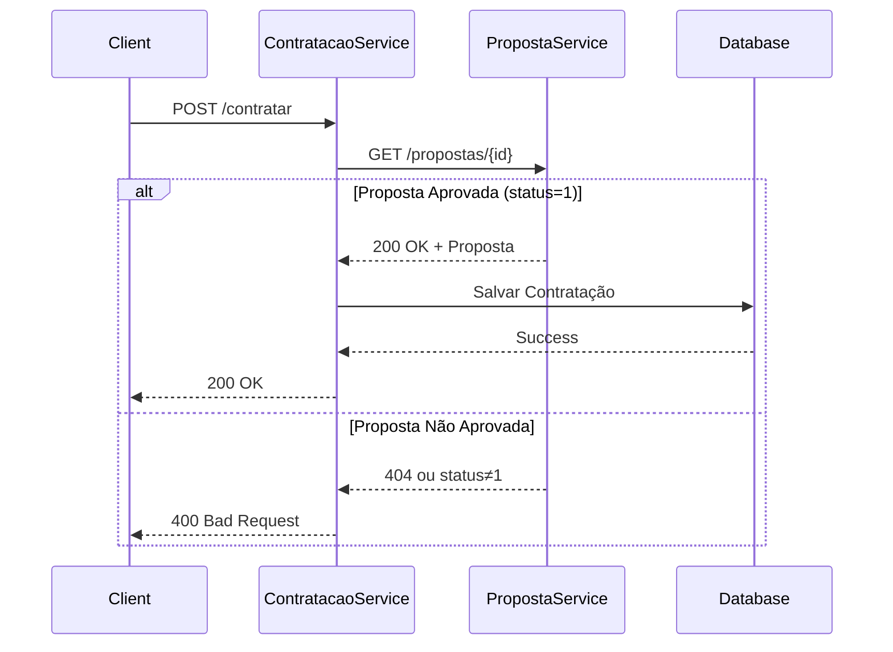

# TesteINDT - Sistema de Microserviços para Seguros

Sistema distribuído baseado em microserviços para gerenciamento de propostas e contratação de seguros, implementando **Padrão Saga** e **Arquitetura Hexagonal**.


## 🏗️ **Arquitetura do Sistema**

### 📐 **Padrões Arquiteturais**

- **🔄 Padrão Saga**: Orquestração de transações distribuídas entre microserviços
- **🏛️ Arquitetura Hexagonal (Ports & Adapters)**: Isolamento do domínio e infraestrutura
- **🔌 Clean Architecture**: Separação clara de responsabilidades em camadas

### 🎯 **Microserviços**

#### 1. **Proposta.Service** (`localhost:5284` | Docker: `localhost:5000`)
Responsável por gerenciar propostas de seguro:
- ✅ **Criar propostas** de seguro
- ✅ **Consultar propostas** por ID ou com paginação
- ✅ **Atualizar status** das propostas (Em Análise → Aprovada → Rejeitada)

#### 2. **Contratacao.Service** (`localhost:5206` | Docker: `localhost:5001`)
Responsável por contratar seguros baseado em propostas aprovadas:
- ✅ **Orquestração Saga** para validar proposta no serviço externo
- ✅ **Contratação de seguro** apenas para propostas aprovadas
- ✅ **Persistência de contratações** no banco de dados

## 🛠️ **Stack Tecnológica**

### **Backend**
- **📝 .NET 9.0** - Framework principal
- **🌐 ASP.NET Core** - APIs REST com Minimal APIs
- **🗄️ Entity Framework Core 9.0** - ORM para persistência
- **🐘 PostgreSQL 15** - Banco de dados relacional
- **🐳 Docker & Docker Compose** - Containerização e orquestração

### **Testes**
- **🧪 xUnit 2.9.0** - Framework de testes unitários
- **🎭 Moq 4.20.72** - Mock objects para testes
- **✨ FluentAssertions 6.12.1** - Assertions expressivas
- **💾 Entity Framework InMemory** - Banco em memória para testes
- **📊 32 testes unitários** com cobertura completa

### **Ferramentas de Desenvolvimento**
- **📋 OpenAPI/Swagger** - Documentação automática de APIs
- **🔗 HttpClient** - Comunicação entre microserviços
- **📄 Arquivos .http** - Testes de endpoint integrados ao VS Code
- **📝 Logging** - Microsoft.Extensions.Logging

## 📁 **Estrutura do Projeto**

```
TesteINDT/
├── 📄 TesteINDT.sln                    # Solution principal
├── 🐳 docker-compose.yml              # Orquestração de containers
├── 📋 README.md                       # Este arquivo
├── 🌐 integration-tests.http          # Testes de integração
├── 📋 README-HTTP-TESTS.md           # Documentação dos testes HTTP
│
├── 🏢 Proposta.Service/              # Microserviço de Propostas
│   ├── 🌐 Proposta.Service.API/      # Camada de apresentação
│   │   ├── 📄 Program.cs             # Configuração da API
│   │   ├── 📋 DTO/                   # Data Transfer Objects
│   │   └── 🔗 *.http                 # Testes de endpoint
│   ├── 🧩 Proposta.Service.Application/ # Camada de aplicação
│   │   ├── 🔌 Adapters/              # Implementações dos Ports
│   │   ├── 🚪 Ports/                 # Interfaces de entrada/saída
│   │   └── ⚙️ Services/              # Serviços de aplicação
│   ├── 🏛️ Proposta.Service.Domain/   # Camada de domínio
│   │   ├── 🎯 Entities/              # Entidades de negócio
│   │   ├── 📊 Enums/                 # Enumerações
│   │   └── 🗄️ Repositories/          # Interfaces de repositório
│   ├── 🏗️ Proposta.Service.Infrastructure/ # Camada de infraestrutura
│   │   ├── 💾 Context/               # DbContext
│   │   ├── 🔧 DI/                    # Dependency Injection
│   │   ├── 🗃️ Entities/              # Entidades de infraestrutura
│   │   ├── 📈 Migrations/            # Migrações do banco
│   │   └── 🗄️ Repositories/          # Implementações dos repositórios
│   └── 🧪 Proposta.Service.Tests/    # Testes unitários
│       ├── 🔌 Adapters/              # Testes dos adapters
│       ├── 🗄️ Repositories/          # Testes dos repositories
│       ├── ⚙️ Services/              # Testes dos services
│       ├── 🔗 Integration/           # Testes de integração
│       └── 🛠️ Helpers/               # Utilitários de teste
│
└── 🏢 Contratacao.Service/           # Microserviço de Contratação
    ├── 🌐 Contratacao.Service.API/   # Camada de apresentação
    ├── 🧩 Contratacao.Service.Application/ # Camada de aplicação
    ├── 🏛️ Contratacao.Service.Domain/ # Camada de domínio
    ├── 🏗️ Contratacao.Service.Infrastructure/ # Camada de infraestrutura
    └── 🧪 Contratacao.Service.Tests/ # Testes unitários (32 testes)
```

## 🚀 **Como Executar**

### **Pré-requisitos**
- **🐳 Docker & Docker Compose**
- **📝 .NET 9.0 SDK** (para desenvolvimento local)
- **🔧 Visual Studio Code** ou **Visual Studio 2022**

### **1. Executar com Docker (Recomendado)**

```bash
# Clone o repositório
git clone <repository-url>
cd TesteINDT

# Subir todos os serviços
docker-compose up -d

# Verificar logs
docker-compose logs -f

# Parar e limpar
docker-compose down -v --remove-orphans
```

**Serviços disponíveis:**
- 🌐 **Proposta Service**: http://localhost:5000
- 🌐 **Contratacao Service**: http://localhost:5001
- 🗄️ **PostgreSQL Proposta**: localhost:5432
- 🗄️ **PostgreSQL Contratacao**: localhost:5433

### **2. Executar Localmente (Desenvolvimento)**

```bash
# Terminal 1 - Subir bancos PostgreSQL
docker-compose up postgres-db-proposta postgres-db-contratacao -d

# Terminal 2 - Proposta Service
cd Proposta.Service/Proposta.Service.API
dotnet run

# Terminal 3 - Contratacao Service  
cd Contratacao.Service/Contratacao.Service.API
dotnet run
```

**Serviços disponíveis:**
- 🌐 **Proposta Service**: http://localhost:5284
- 🌐 **Contratacao Service**: http://localhost:5206

### **3. Executar Testes**

```bash
# Testes do Contratacao.Service (32 testes)
cd Contratacao.Service/Contratacao.Service.Tests
dotnet test

# Testes do Proposta.Service
cd Proposta.Service/Proposta.Service.Tests
dotnet test
```

## 🌐 **Endpoints da API**

### **Proposta.Service**

| Método | Endpoint | Descrição |
|--------|----------|-----------|
| `POST` | `/propostas` | Criar nova proposta |
| `GET` | `/propostas/{id}` | Obter proposta por ID |
| `GET` | `/propostas?pagina={}&tamanhoPagina={}` | Listar propostas (paginado) |
| `PUT` | `/propostas/{id}/status` | Atualizar status da proposta |

### **Contratacao.Service**

| Método | Endpoint | Descrição |
|--------|----------|-----------|
| `POST` | `/contratar` | Contratar seguro baseado em proposta |

## 📋 **Fluxo de Negócio**

### **🔄 Padrão Saga - Fluxo de Contratação**

1. **📝 Criar Proposta** no `Proposta.Service`
   ```json
   POST /propostas
   {
     "segurado": "João Silva",
     "produto": "Seguro Auto", 
     "valor": 1500.00,
     "status": 0  // Em Análise
   }
   ```

2. **✅ Aprovar Proposta** no `Proposta.Service`
   ```json
   PUT /propostas/{id}/status
   { "status": 1 }  // Aprovada
   ```

3. **🤝 Contratar Seguro** no `Contratacao.Service`
   ```json
   POST /contratar
   { "propostaId": "guid-da-proposta" }
   ```

4. **🔍 Saga Orchestration**:
   - `Contratacao.Service` consulta `Proposta.Service` via HTTP
   - Verifica se proposta está **APROVADA** (status = 1)
   - Se aprovada: salva contratação e retorna sucesso
   - Se não aprovada: retorna erro sem salvar

### **📊 Status das Propostas**
- **0** - 🔍 Em Análise
- **1** - ✅ Aprovada  
- **2** - ❌ Rejeitada

## 🧪 **Testes**

### **Testes Unitários (32 testes ✅)**

**Contratacao.Service.Tests:**
- 🗄️ **Repository Tests** (6 testes) - CRUD operations
- 🔌 **Adapter Tests** (13 testes) - HTTP communication & data transformation
- ⚙️ **Service Tests** (7 testes) - Business logic & orchestration  
- 🔗 **Integration Tests** (6 testes) - End-to-end workflows

**Cobertura:**
- ✅ **Happy Path** - Fluxos de sucesso
- ❌ **Error Handling** - Cenários de falha
- 🔄 **Edge Cases** - Casos extremos
- 🌐 **HTTP Communication** - Mocks de serviços externos

### **Testes de API (.http files)**

Arquivo: `integration-tests.http`
- ✅ **Cenário 1**: Fluxo completo de sucesso (Local)
- ✅ **Cenário 2**: Fluxo completo de sucesso (Docker)  
- ❌ **Cenário 3**: Proposta rejeitada
- ❌ **Cenário 4**: Proposta inexistente

**Como executar:**
1. Instalar extensão **REST Client** no VS Code
2. Abrir arquivo `.http`
3. Clicar em "Send Request"

## 💾 **Banco de Dados**

### **PostgreSQL - Separação por Microserviço**

**Proposta.Service DB** (Porta 5432):
```sql
-- Propostas de seguro
Table: PropostaInfraEntity
- Id (UUID, PK)
- Data (DateTime)
- Segurado (VARCHAR)
- Produto (VARCHAR) 
- Valor (DECIMAL)
- Status (INT)
```

**Contratacao.Service DB** (Porta 5433):
```sql
-- Contratações realizadas
Table: ContratacaoInfraSeguro  
- Id (UUID, PK)
- PropostaId (UUID, FK)
- Data (DateTime)
```

## 🏛️ **Arquitetura Hexagonal**

### **Ports (Interfaces)**
- **🚪 IPropostaServicePort** - Comunicação com serviço externo
- **🚪 IContratacaoSaidaPort** - Persistência de contratações
- **🚪 IEntradaPropostaPort** - Entrada de dados de proposta
- **🚪 ISaidaPropostaPort** - Saída de dados de proposta

### **Adapters (Implementações)**
- **🔌 PropostaServiceAdapter** - HTTP client para comunicação entre serviços
- **🔌 ContratacaoSaidaAdapter** - Wrapper para repository
- **🔌 PropostaEntradaAdapter** - Conversão de DTOs
- **🔌 PropostaSaidaAdapter** - Persistência via repository

### **Vantagens da Arquitetura**
- ✅ **Testabilidade** - Mocks fáceis dos adapters
- ✅ **Flexibilidade** - Troca de implementações
- ✅ **Isolamento** - Domínio independente da infraestrutura
- ✅ **Manutenibilidade** - Separação clara de responsabilidades

## 🔄 **Padrão Saga**

### **Orquestração vs Coreografia**
O projeto implementa **Orquestração Saga**, onde:

- **🎯 Contratacao.Service** = **Saga Orchestrator**
- **📋 Proposta.Service** = **Saga Participant**

### **Fluxo da Saga**


### **Tratamento de Falhas**
- ❌ **Proposta não encontrada** → HTTP 404
- ❌ **Proposta não aprovada** → HTTP 400
- ❌ **Erro de comunicação** → HTTP 500
- ❌ **Erro de persistência** → Rollback automático

## 🔧 **Configuração**

### **appsettings.json**
```json
{
  "ConnectionStrings": {
    "DefaultConnection": "Host=localhost;Port=5432;Database=PropostaDb;Username=user;Password=password"
  },
  "Services": {
    "PropostaService": {
      "BaseUrl": "http://localhost:5284"
    }
  },
  "Logging": {
    "LogLevel": {
      "Default": "Information"
    }
  }
}
```

### **Docker Environment**
```yaml
environment:
  - ASPNETCORE_ENVIRONMENT=Development
  - ConnectionStrings__DefaultConnection=Host=postgres-db;Port=5432;Database=PropostaDb;Username=user;Password=password
  - Services__PropostaService__BaseUrl=http://proposta-service:8080
```

## 📊 **Monitoring & Observabilidade**

### **Health Checks**
```yaml
healthcheck:
  test: ["CMD-SHELL", "pg_isready -U user"]
  interval: 15s
  timeout: 5s
  retries: 5
```

### **Logging**
- **📊 Structured Logging** com Microsoft.Extensions.Logging
- **🔍 Request/Response logging** em Development
- **❌ Error tracking** com stack traces
- **🐳 Container logs** via Docker Compose

### **OpenAPI Documentation**
- **📋 Swagger UI** disponível em Development
- **📄 OpenAPI Spec** em `/openapi/v1.json`
- **📝 Endpoint documentation** com summaries

## 🛡️ **Boas Práticas**

### **Código**
- ✅ **SOLID Principles** aplicados
- ✅ **Clean Code** com nomes expressivos
- ✅ **Dependency Injection** nativo do .NET
- ✅ **Async/Await** para operações I/O
- ✅ **Exception Handling** estruturado

### **Testes**
- ✅ **AAA Pattern** (Arrange-Act-Assert)
- ✅ **Test Isolation** com DbContext em memória
- ✅ **Mock External Dependencies**
- ✅ **Comprehensive Coverage** (Happy + Error paths)

### **Docker**
- ✅ **Multi-stage builds** para otimização
- ✅ **Health checks** para dependências
- ✅ **Environment separation** (Dev/Prod)
- ✅ **Volume persistence** para bancos

## 🚨 **Solução de Problemas**

### **Erro de Conexão com Banco**
```bash
# Verificar se PostgreSQL está rodando
docker-compose ps

# Verificar logs do banco
docker-compose logs postgres-db-proposta

# Recriar volumes se necessário
docker-compose down -v
docker-compose up -d
```

### **Erro 404 - Proposta não encontrada**
- ✅ Verificar se a proposta foi criada no `Proposta.Service`
- ✅ Confirmar GUID correto
- ✅ Testar endpoint GET antes do POST

### **Erro 400 - Não foi possível contratar**
- ✅ Verificar se proposta está com status **Aprovada** (1)
- ✅ Confirmar comunicação entre serviços
- ✅ Validar configuração de BaseUrl

### **Testes Falhando**
```bash
# Limpar e rebuildar
dotnet clean
dotnet restore
dotnet build
dotnet test
```
---

**✨ Desenvolvido com .NET 9.0, implementando Padrão Saga e Arquitetura Hexagonal para máxima flexibilidade e testabilidade.**
